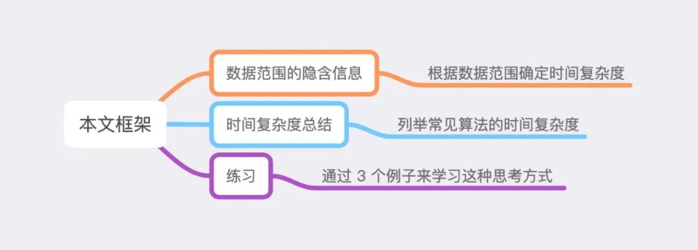
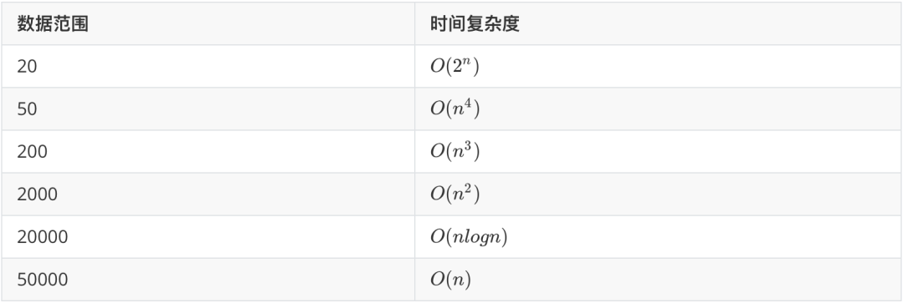
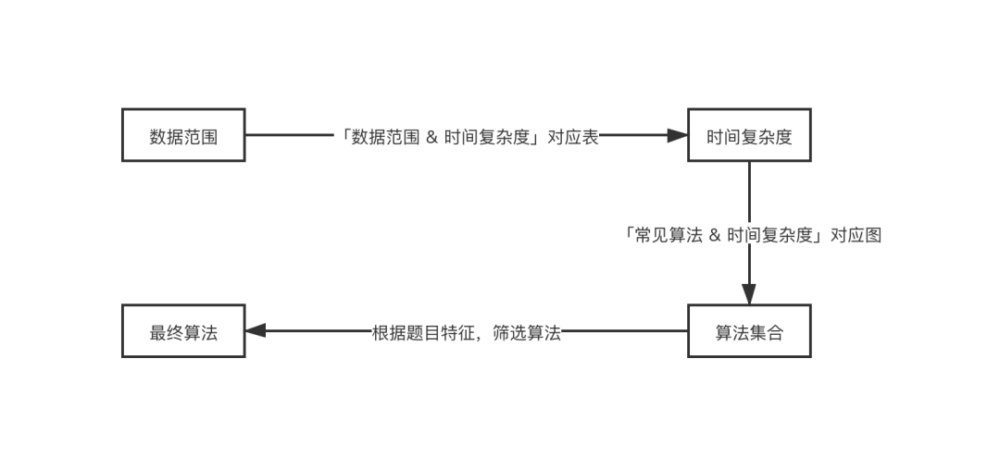

### 前言

众所周知，算法题主要有两大难点，一是「实现」，即算法本身的难度；二是「思路」，即你能否想到使用这个算法来解决题目。

并且对于有一定刷题基础的同学来说，力扣上大部分简单、中等题所涉及的算法都是非常常见的算法，即算法本身不存在难度，最大的难点在于「思路」，即如何想到适合本题的算法。

而解决「思路」问题，除了大量刷题积累经验之外，还可以采用一定的「巧劲」，从时间复杂度这个角度入手筛选出合适的算法。而本文的主要目的就是向大家介绍这种「巧劲」是如何在具体解题过程中发挥作用的。

本文一共分成三个部分，具体内容框架如下所示：


### 一、数据范围的隐含信息

如何确定一道题合适的时间复杂度？最简单、快捷的方式就是通过观察题目中的数据范围来确定。

不过你可能马上会反驳，力扣上并不是所有题目都有数据范围，那又该如何确定呢？

不要急噢，没有数据范围也是可以采用这种方式来思考的，我们会在「练习」部分进行详细说明。

言归正传，如何通过数据范围来确定合适的时间复杂度呢？

通常来说，在力扣上，Python 可以支持到 10^7的时间复杂度；C++ 会稍微多一点，大概 10^7 - 10^8 之间。因此我们可以得到如下表所示的，数据范围与算法大致时间复杂度的对应表。


### 二、算法时间复杂度总结

通过数据范围得到时间复杂度后，我们需要对照下图筛选出适合的算法进行求解。


此处有两点需要注意：

1. 上图仅列出了时间复杂度较为固定的常见算法，而类似于动态规划、贪心、暴力等时间复杂度百变多样的算法并未列出。

2. O(logn) 的算法通常与 O(n) 的算法组合在一起，用于实现 O(nlogn) 要求的题目。

### 三、练习

在讲解具体题目之前，我们先明确一下根据时间复杂度做题的具体流程：

1. 根据数据范围选择时间复杂度

2. 根据时间复杂度选择对应的常见算法集合

3. 思考题目特征，从集合中选出合适的算法

4. 根据选出的算法求解题目

接下来我们从力扣「2020-04月 每日一题」中选取三道题用于该流程的练习。

[力扣 1248. 统计「优美子数组」](https://leetcode-cn.com/problems/count-number-of-nice-subarrays/)

##### 题目描述

给你一个整数数组 nums 和一个整数 k。

如果某个连续子数组中恰好有 k 个奇数数字，我们就认为这个子数组是「优美子数组」。

请返回这个数组中「优美子数组」的数目。

示例 1:  
输入：nums = [1,1,2,1,1], k = 3  
输出：2  
解释：包含 3 个奇数的子数组是 [1,1,2,1] 和 [1,2,1,1] 。  
示例 2:
输入：nums = [2,4,6], k = 1  
输出：0  
解释：数列中不包含任何奇数，所以不存在优美子数组。  
示例 3:
输入：nums = [2,2,2,1,2,2,1,2,2,2], k = 2  
输出：16

##### 数据范围

1 <= nums.length <= 50000  
1 <= nums[i] <= 10^5  
1 <= k <= nums.length

##### 解决过程

* 数据范围 => 时间复杂度  
  本题的数据范围到达了 50000，因此我们将时间复杂度划定在 O(n) 的范围内。

* 时间复杂度 => 常见算法集合  
  根据上述「常见算法 & 时间复杂度」图，我们可以划定本题的算法集合。由于此题明显是数组上操作的问题，因此我们仅列出 O(n) 范围内关于数组的算法。

```差分、前缀和、双指针、桶排序、单调栈、单调队列```

* 思考题目特征 => 从集合中选出合适算法
* 仔细观察题干，可以发现本题有两大关键特征：

1. 连续子数组
2. 子数组内恰好有 k 个奇数数字

如果对「前缀和」算法有所掌握的话，凭借这两大特征不难确定此题可以用「前缀和」求解。

令sum[i]表示数组第 0 个数到第 i 个数中奇数的个数，因此区间 [left, right] 符合题意，当且仅当下式成立：

sum[right]-sum[left-1]=k

由此我们可以令 mp[x] 表示有多少个节点 i 满足 sum[i]=x。然后从左向右枚举，当求得第 i 个点的sum 值后，更新mp[sum[i]]数组，并计算有多少个 left
满足区间 [left, i] 符合题意。累加答案即可得到最终结果，具体实现可参看下述代码。

```python
from typing import List


class Solution:
    def numberOfSubarrays(self, nums: List[int], k: int) -> int:
        cnt = [0] * (len(nums) + 1)
        cnt[0] = 1
        odd, ans = 0, 0
        for num in nums:
            if num % 2 == 1:
                odd += 1
            if odd >= k:
                ans += cnt[odd - k]
            cnt[odd] += 1
        return ans
```

[面试题 08.11. 硬币](https://leetcode-cn.com/problems/coin-lcci/)

#### 题目描述

硬币。给定数量不限的硬币，币值为 25 分、10 分、5 分和 1 分，编写代码计算 n 分有几种表示法。(结果可能会很大，你需要将结果模上 1000000007)

示例 1:  
输入: n = 5  
输出：2  
解释: 有两种方式可以凑成总金额:  
5=5  
5=1+1+1+1+1

示例 2:  
输入: n = 10  
输出：4  
解释: 有四种方式可以凑成总金额:  
10=10  
10=5+5  
10=5+1+1+1+1+1  
10=1+1+1+1+1+1+1+1+1+1

##### 数据范围

0 <= n (总金额) <= 1000000

##### 解决过程

* 数据范围 => 时间复杂度  
  本题的数据范围到达了 1000000，因此我们将时间复杂度划定在O(n) 的范围内。再仔细观察一下「常见算法 & 时间复杂度」图，可以发现由于只有 4 种面值的硬币，因此 O(mn)
  的背包也是可行的。

* 时间复杂度 => 常见算法集合  
  根据时间复杂度与「常见算法 & 时间复杂度」图，我们可以划定本题的算法集合。由于此题明显与图论、字符串等算法无关，因此我们仅列出 O(n) 、 O(mn) 范围内有一定可能性的算法。

```差分、前缀和、双指针、桶排序、单调栈、单调队列、背包问题```

* 思考题目特征 => 从集合中选出合适算法  
  仔细观察此题，可以发现如下几个特征：

1. 四类硬币
2. 每类硬币数量不限
3. 求组成 n 的方案数

如果对「动态规划」有一定熟悉度的话，基本可以确定此题就是「动态规划问题」，因此本题具有很明显的「子结构」性质。

然后再根据之前确定的时间复杂度 O(n) 、 O(mn) ，以及我们选出的算法，基本可以确定该动态规划问题的状态，只有如下两种：

1. f[i]表示用四种硬币组成 i 分的方案数，属于典型线性 DP

2. f[i][j] 表示用前 i 种硬币组成 j 分的方案数，属于背包问题

再仔细思考两种状态的转移方程，可以发现第二种采用背包思路的 DP 状态更适合解决本题，且由于硬币个数不限，因此是经典的「完全背包」问题。所以我们可以直接列出如下的转移方程（ coin[i] 表示第 i
类硬币的面值）：

```
f[i][j] = f[i-1][j]  
f[i][j] = f[i][j] + f[i][j-coin[i]]
```

可以发现， f[i][j] 的数值主要由 f[i-1][j] 与 f[i][j-coin[j]] 得到，因此我们可以压缩掉第一维，即采用滚动数组的方法，得到如下方程：

```f[j] = f[j] + f[j-coin[i]]```  
由于「完全背包」是背包问题中的经典模型，因此更具体的细节，大家可以参考下述代码。

```python
class Solution:
    def waysToChange(self, n: int) -> int:
        coins = [1, 5, 10, 25]
        dp = [0] * (n + 1)
        dp[0] = 1
        for coin in coins:
            for i in range(coin, n + 1):
                dp[i] = (dp[i] + dp[i - coin])

        return dp[n] % 1000000007
```

[56. 合并区间](https://leetcode-cn.com/problems/merge-intervals/)

##### 题目描述

给出一个区间的集合，请合并所有重叠的区间。

示例 1:

输入: intervals = [[1,3],[2,6],[8,10],[15,18]]  
输出: [[1,6],[8,10],[15,18]]  
解释: 区间 [1,3] 和 [2,6] 重叠, 将它们合并为 [1,6].

示例2:

输入: intervals = [[1,4],[4,5]]  
输出: [[1,5]]  
解释: 区间 [1,4] 和 [4,5] 可被视为重叠区间。  
注意：输入类型已于2019年4月15日更改。 请重置默认代码定义以获取新方法签名。

提示：

intervals[i][0] <= intervals[i][1]

#### 解决过程

* 数据范围 => 时间复杂度  
  现在我们来解决最开头提到的那个问题，「力扣上并不是所有题目都有数据范围，那又该如何确定呢？」。此题就属于没有数据范围的题目，并且在很多面试题中，也都是没有数据范围的，这时应该怎么办呢？  
  根据经验，对于此类没有数据范围的题目，我们通常需要自行从小到大枚举数据范围，一般从 O(n)开始枚举，并且大部分的题枚举到 O(nlogn) 时就能找到合适的算法。

因此对于此题，我们暂且将时间复杂度限制在 O(n)-O(nlogn) 之间。

* 时间复杂度 => 常见算法集合 有了时间复杂度之后，我们就可以根据「常见算法 & 时间复杂度」图划定算法集合。由于此题明显与图、计算几何、字符串无关，因此我们可以大致确定如下的算法集合。

```差分、前缀和、双指针、桶排序、单调栈、单调队列、堆、ST 表、线段树、树状数组、排序```

* 思考题目特征 => 从集合中选出合适算法 仔细观察此题，可以发现本题题意很明确，就是合并重叠区间，那怎样的区间算重叠呢？

现有两个区间，分别为 [l1, r1]、[l2, r2]，假设 l1 <= l2，则当 l2 <= r1 时，两个区间发生重叠。

此时再根据上述选出的算法集合，一一排除、筛选，不难发现本题可用「排序」解决。即对于所有区间，按照左端点排序，然后从左到右枚举所有区间，对于区间 i 来说，l[i-1] <= l[i]
，则我们只需判断l[i] <= r[i-1]是否成立。如果成立，则合并两个区间，否则不合并。

由此我们便可以通过「排序」算法解决此题，具体的代码细节如下所示。

```python
class Solution:
    def merge(self, intervals: List[List[int]]) -> List[List[int]]:
        if not intervals:
            return []
        intervals.sort(key=lambda x: x[0])
        length = len(intervals)
        result = [intervals[0]]
        for idx in range(1, length):
            if intervals[idx][0] > result[-1][1]:
                result.append(intervals[idx])
            else:
                result[-1][1] = max(result[-1][1], intervals[idx][1])
        return result
```

# 总结

最后，我们来总结一下「数据范围」=> 「最终算法」的总体过程，如下图所示。


除此之外，还需注意，从「数据范围」入手思考「最终算法」只是获取题目思路的手段之一，并且在上述流程图中，「根据题目特征，筛选算法」是最为关键的步骤，这不仅要求做题者具有「挖掘题目特征」的能力，更要求做题者对于「常见算法」要有一定的熟悉度。

也正是因为这个原因，「常见算法 & 时间复杂度」对应图是具有个人特征的。每个人由于掌握的算法不同，「常见算法 & 时间复杂度」图也各不相同，因此希望大家能够有意识地构建属于自己的「常见算法 &
时间复杂度」图，并在刷题的过程中，不断更新，不断完善。力求能够在遇到自己掌握范围内的算法题时，一举击破。

最后的最后，祝大家刷题愉快，能力蹭蹭蹭往上涨。